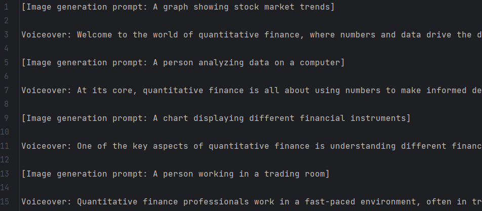

# 
**VIDEO GENERATOR**

This is an automatic video creator based on the topic you give the AI model. The first one, you give the AI model a topic that you want to create a video, it will generate for you a script
in that field. In the generated script, there are 2 parts, part of it is used for generate images, and the rest is use for generate an audio. 
From that script, there will be another AI model used for create images and audio, and then rely on them to concatenate the video.
Final, create subtitles for the created video.

## Installation

- Click **[here](https://git-scm.com/downloads)** to download Git (ignore if your local is installed it).
- Click **[here](https://www.python.org/downloads/)** to download python. Download python 3.9.18 version (ignore if your local is installed it).
- Click **[here](https://www.anaconda.com/download)** to download Anaconda (ignore if your local is installed it).
- After downloaded and installed them. Open your local terminal and type the code given below to clone the repos:\
**git clone https://github.com/qhle2001/Video_Generator.git**
- After cloned repos, you must install requirements. In that terminal, type: **cd Video_Generator** to move to the folder you just cloned and then type: **pip install -r requirements.txt**

## Usage

- The first one, type: **python createfolder.py** to create some folder used for save the generated file (only need to do it once).
- Then, type: **python ScriptGen.py** to create the script used for video generation after. Tips: The generation script is saved in the generated_text.txt file in results folder. 
You should go there to check the generated script whether its format correct or not (because AI model can generate an incorrect script format). 
In addition, you can fix the content follow own yourself. Bellow is an example of a properly formatted script.\
Ex:\
\
[ ] may or may not be present.
- After that, you can type: **python VideoGen.py** to create a video follow the generated script.
- Final, type: **python Subtitles.py** to create subtitles after you had a video.

## Note

- You must paste your own API key of openai into API_KEY.txt file before you run above steps.
- After you create a Video or create a Subtitles for your own video, you should type: **python removefile.py** to remove all file in audio, images, and videos folder 
to ensure that your next video generation will be problem-free.
- All generation files are saved in **results** folder.
